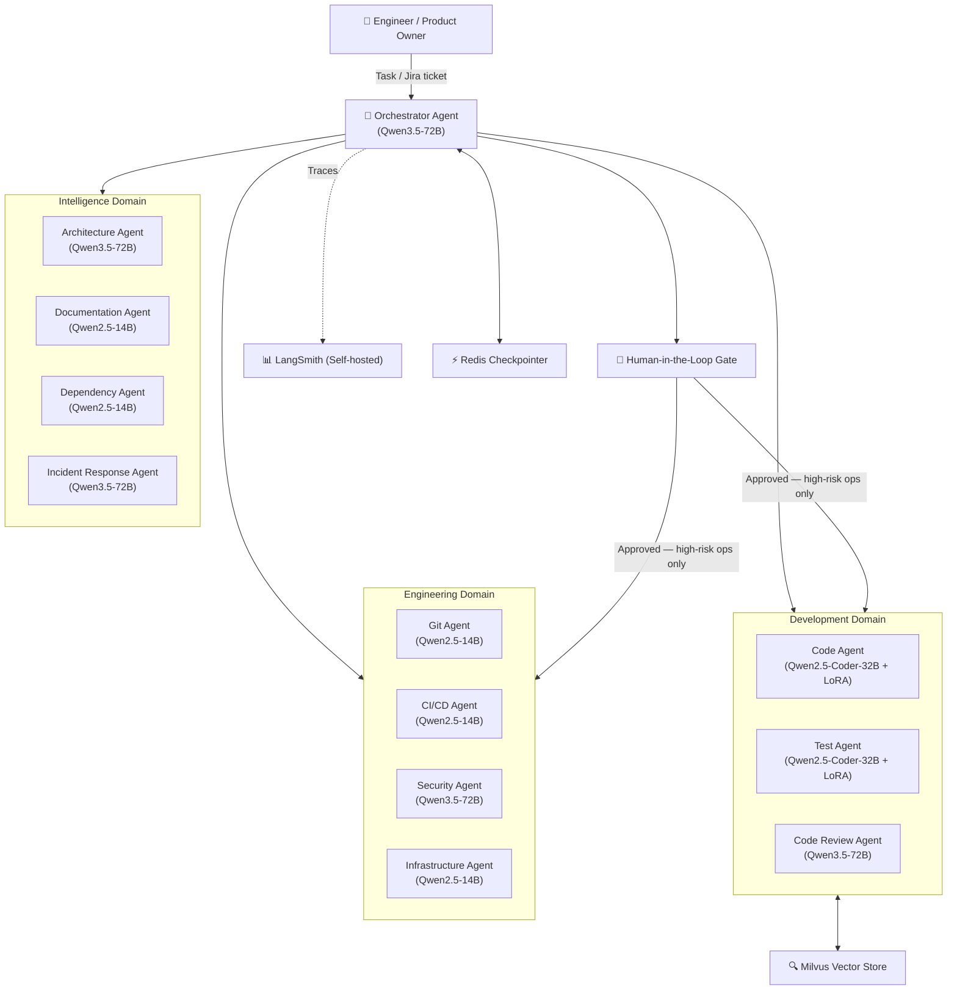

# Development Team

[](https://www.python.org/downloads/release/python-3120/)
[](https://github.com/langchain-ai/deepagents)
[](https://github.com/langchain-ai/langgraph)
[](LICENSE)

Autonomous twelve-agent AI system that writes, tests, reviews, and deploys code across Go, TypeScript, Java, and Python.

## Highlights

- **12 specialist agents, zero ticket backlogs** — the Orchestrator decomposes Jira tickets into subtasks and delegates them across four capability domains: Orchestration, Development, Engineering, and Intelligence
- **TDD enforced structurally** — the Code Agent cannot commit code that does not pass the Test Agent's tests; the Red→Green→Refactor cycle is a LangGraph state machine, not a convention
- **Human-in-the-loop by design** — production deployments, main-branch merges, and architectural decisions require explicit human approval via LangGraph interrupt nodes; everything else runs autonomously
- **Self-hosted, data-residency safe** — all models (Qwen3.5-72B, Qwen2.5-Coder-32B, Qwen2.5-14B, Llama-Guard-3-8B) and observability (LangSmith) run inside your Red Hat OpenShift AI cluster; no data leaves the boundary
- **Six-layer prompt injection defence** — Llama Guard 3 input screening, system prompt hardening, tool-level RBAC, pre-execution output guardrail, HITL gate, and an immutable LangSmith audit trail
- **MCP for every external system** — GitHub, Jira, SonarQube, Jenkins, Slack, ArgoCD, and HashiCorp Vault are all connected via Red Hat UBI-based MCP server containers; no bespoke API integration code

## Table of Contents

- [Agent Architecture](#agent-architecture)
- [Installation](#installation)
- [Quick Start](#quick-start)
- [Configuration](#configuration)
- [Usage](#usage)
- [Human-in-the-Loop Gates](#human-in-the-loop-gates)
- [Observability](#observability)
- [Deployment](#deployment)
- [Contributing](#contributing)
- [License](#license)

## Agent Architecture

The system is organised into four capability domains. The Orchestrator is the single entry point; all other agents are sub-agents spawned via the DeepAgents `task` tool with isolated context windows.



| Domain | Agents | Model Tier |
|---|---|---|
| **Orchestration** | Orchestrator | Reasoning — Qwen3.5-72B (2× A100 80GB, tensor parallel) |
| **Development** | Code, Test, Code Review | Code — Qwen2.5-Coder-32B + LoRA (1× A100 80GB) |
| **Engineering** | Git, CI/CD, Security, Infrastructure | Utility — Qwen2.5-14B (1× A100 40GB) |
| **Intelligence** | Architecture, Documentation, Dependency, Incident Response | Reasoning / Utility tiers |

Full architecture documentation lives in [`docs/architecture/`](docs/architecture/).

## Installation

**Prerequisites:**

- Python 3.12 or later
- [uv](https://docs.astral.sh/uv/) — Rust-based Python package manager (replaces pip + virtualenv)
- Red Hat OpenShift AI 2.x cluster with GPU nodes (see [Deployment](#deployment))
- Access to model weights on ODF/S3 (see [`docs/architecture/05-deployment.md`](docs/architecture/05-deployment.md))

Install `uv` if you do not already have it:

```bash
curl -LsSf https://astral.sh/uv/install.sh | sh
```

Clone the repository and install all runtime dependencies:

```bash
git clone https://github.com/<your-org>/development-team.git
cd development-team
uv sync
```

For development (includes linting, type-checking, and test dependencies):

```bash
uv sync --extra dev
```

> **Note:** This repository contains the agent definitions, orchestration logic, and skills configuration.
> The vLLM inference endpoints and MCP server containers are deployed separately on OpenShift AI.
> See [`docs/architecture/05-deployment.md`](docs/architecture/05-deployment.md) for the full platform setup.

## Quick Start

With the OpenShift AI cluster and vLLM endpoints running, submit a development task to the Orchestrator:

```python
from development_team.orchestrator import create_orchestrator
from langchain_core.messages import HumanMessage

# Initialise the Orchestrator (thread_id is the LangGraph checkpoint key)
orchestrator = create_orchestrator(thread_id="sprint-42-task-1")

# Submit a task in natural language — the Orchestrator handles decomposition and delegation
result = orchestrator.invoke(
    {"messages": [HumanMessage(content=(
        "Implement a rate-limiter middleware for the Go API service. "
        "Max 100 req/s per client IP. Sliding window algorithm. Jira: DEV-1042"
    ))]},
    config={"configurable": {"thread_id": "sprint-42-task-1"}}
)

print(result["messages"][-1].content)
# The Orchestrator decomposes the task, delegates to Test Agent (Red phase),
# then Code Agent (Green → Refactor), then Git Agent to raise the PR.
```

Watch the full execution trace in LangSmith at `http://<your-langsmith-host>`.

## Configuration

All configuration is supplied via environment variables. In production, these are injected by the HashiCorp Vault Agent Injector sidecar at pod start. For local development, copy `.env.example` to `.env` and populate the values.

| Variable | Required | Description |
|---|---|---|
| `OPENAI_BASE_URL` | ✅ | vLLM reasoning endpoint (Qwen3.5-72B), e.g. `https://vllm-reasoning.dev-team-inference.svc.cluster.local/v1` |
| `OPENAI_API_KEY` | ✅ | API key for the vLLM endpoint (any non-empty string if your deployment does not enforce auth) |
| `CODE_MODEL_BASE_URL` | ✅ | vLLM code endpoint (Qwen2.5-Coder-32B) |
| `UTILITY_MODEL_BASE_URL` | ✅ | vLLM utility endpoint (Qwen2.5-14B) |
| `GUARDRAIL_MODEL_BASE_URL` | ✅ | vLLM guardrail endpoint (Llama-Guard-3-8B) |
| `LANGCHAIN_TRACING_V2` | ✅ | Set to `true` to enable LangSmith tracing |
| `LANGCHAIN_ENDPOINT` | ✅ | Self-hosted LangSmith API endpoint, e.g. `https://langsmith.dev-team-observability.svc.cluster.local` |
| `LANGCHAIN_API_KEY` | ✅ | LangSmith API key |
| `LANGCHAIN_PROJECT` | ✅ | LangSmith project name, e.g. `development-team-production` |
| `REDIS_URL` | ✅ | Redis Sentinel URL for the LangGraph checkpointer, e.g. `redis://redis-sentinel.dev-team-agents.svc.cluster.local:26379/0` |
| `MILVUS_URI` | ✅ | Milvus gRPC endpoint for codebase semantic search, e.g. `milvus.dev-team-agents.svc.cluster.local:19530` |
| `SKILLS_REPO_URL` | ✅ | HTTPS URL of the skills Git repository loaded at agent boot |
| `VAULT_ADDR` | ✅ | HashiCorp Vault address (injected automatically in production by Vault Agent Injector) |
| `HITL_APPROVAL_WEBHOOK` | ✅ | Webhook URL the HITL Gate calls to request human approval (Slack or custom UI) |
| `GITHUB_MCP_URL` | ✅ | URL of the GitHub MCP server container |
| `JIRA_MCP_URL` | ✅ | URL of the Jira MCP server container |
| `SONAR_MCP_URL` | ✅ | URL of the SonarQube MCP server container |
| `JENKINS_MCP_URL` | ✅ | URL of the Jenkins MCP server container |
| `SLACK_MCP_URL` | ✅ | URL of the Slack MCP server container |
| `LOG_LEVEL` | — | Agent container log level. Default: `INFO` |

## Usage

### Submitting a task programmatically

```python
from development_team.orchestrator import create_orchestrator
from langchain_core.messages import HumanMessage

orchestrator = create_orchestrator(thread_id="task-001")

response = orchestrator.invoke(
    {"messages": [HumanMessage(content=(
        "Add OpenTelemetry tracing to the TypeScript API service. "
        "Follow existing patterns in src/middleware/. Jira: DEV-2100"
    ))]},
    config={"configurable": {"thread_id": "task-001"}}
)
print(response["messages"][-1].content)
```

### Streaming agent execution in real time

```python
from development_team.orchestrator import create_orchestrator
from langchain_core.messages import HumanMessage

orchestrator = create_orchestrator(thread_id="task-002")

for chunk in orchestrator.stream(
    {"messages": [HumanMessage(content="Run a full dependency audit on the payments service.")]},
    config={"configurable": {"thread_id": "task-002"}},
    stream_mode="values"
):
    latest = chunk["messages"][-1]
    if latest.content:
        print(latest.content)
```

### Resuming a task paused at a Human-in-the-Loop gate

```python
from development_team.orchestrator import create_orchestrator

# Use the same thread_id — LangGraph reloads graph state from Redis automatically
orchestrator = create_orchestrator(thread_id="task-001")

orchestrator.invoke(
    {"messages": []},  # No new input needed; the approval token resumes the graph
    config={"configurable": {"thread_id": "task-001"}}
)
```

Or approve from the command line:

```bash
uv run python -m development_team.hitl approve --thread-id task-001
```

### Invoking a specialist agent directly

```python
from development_team.agents.code import create_code_agent
from langchain_core.messages import HumanMessage

code_agent = create_code_agent(language="go", thread_id="code-001")

result = code_agent.invoke(
    {"messages": [HumanMessage(content=(
        "Implement the rate-limiter as specified in the failing tests "
        "in ./pkg/middleware/ratelimit_test.go"
    ))]},
    config={"configurable": {"thread_id": "code-001"}}
)
```

## Human-in-the-Loop Gates

The Orchestrator pauses and requests human approval before executing any of the following operations. The task state is persisted to Redis; it resumes exactly where it left off after approval.

| Operation | Reason |
|---|---|
| Merge to `main` or any protected branch | Irreversible change to the canonical codebase |
| Production deployment | Customer-facing impact |
| Architectural decisions (ADRs) | Long-lived technical commitment |
| Infrastructure changes to production | OpenShift cluster state change |
| Security Agent–flagged operations | Potential security impact identified by automated scanning |

When a gate is reached, the HITL webhook posts an approval request to the configured Slack channel. Engineers approve or reject directly from Slack. Rejected tasks are cancelled and logged to LangSmith with the rejection reason.

## Observability

All agents emit traces automatically to the self-hosted LangSmith instance because every agent is a compiled LangGraph graph with tracing enabled at the harness level. No per-agent instrumentation is required beyond the `LANGCHAIN_*` environment variables.

Every trace captures the full execution tree — every LLM call, tool invocation, sub-agent delegation, token count, latency, and retry. The LangSmith `run_id` is propagated as a correlation field in all git commit messages, PR descriptions, and Jira comments, providing end-to-end traceability from user prompt to deployed change.

LangSmith features used by this system:

- **Thread view** — links multi-turn task traces across HITL interrupts and resumes
- **Time-travel debugging** — replay any prior graph state to diagnose failures
- **Evaluation datasets** — automated eval runs against a curated set of representative tasks
- **Alerting** — configurable alerts on error rate, token cost, and P95 latency thresholds

Access the LangSmith dashboard at `http://<your-langsmith-host>` after deployment.

For the full observability design, security audit trail, and metrics definitions, see [`docs/architecture/06-cross-cutting-concerns.md`](docs/architecture/06-cross-cutting-concerns.md).

## Deployment

The system runs on **Red Hat OpenShift AI 2.x** with vLLM served via KServe `InferenceService` resources, state persisted in Redis Sentinel, and codebase embeddings stored in Milvus. Agent pods scale automatically via KEDA based on LangSmith queue depth.

See [`docs/architecture/05-deployment.md`](docs/architecture/05-deployment.md) for the complete deployment guide, including:

- Namespace layout (`dev-team-agents`, `dev-team-inference`, `dev-team-observability`, `dev-team-platform`)
- KServe `InferenceService` definitions for all four model tiers (Reasoning, Code, Utility, Guardrail)
- Multi-LoRA adapter configuration for the Code tier (Go, TypeScript, Java, Python, test-expert adapters)
- Redis Sentinel HA configuration with `noeviction` policy and AOF persistence
- Milvus StatefulSet with etcd and ODF backing storage
- KEDA `ScaledObject` definitions for agent pod autoscaling
- ArgoCD GitOps model — the Infrastructure Agent commits manifests; ArgoCD reconciles

For the architecture overview and design decisions see [`docs/architecture/`](docs/architecture/).

## Contributing

Contributions are welcome. To get started:

1. Fork the repository and create a branch from `main`
2. Install development dependencies: `uv sync --extra dev`
3. Run the test suite to confirm everything passes: `uv run pytest`
4. Run linting and type checks: `uv run ruff check . && uv run mypy .`
5. Open a pull request with a clear description of the change

Please open an issue before starting work on any significant change — particularly changes to the agent graph topology, new MCP server integrations, modifications to the HITL gate logic, or new LoRA adapter strategies — so the approach can be discussed first.

Open items and known technical debt are tracked in [`docs/architecture/.checklist.md`](docs/architecture/.checklist.md).

## License

<!-- TODO: Add a LICENSE file to the repository root. The identifier below assumes MIT; update if different. -->
[MIT](LICENSE) © 2026 Joseph Searle
