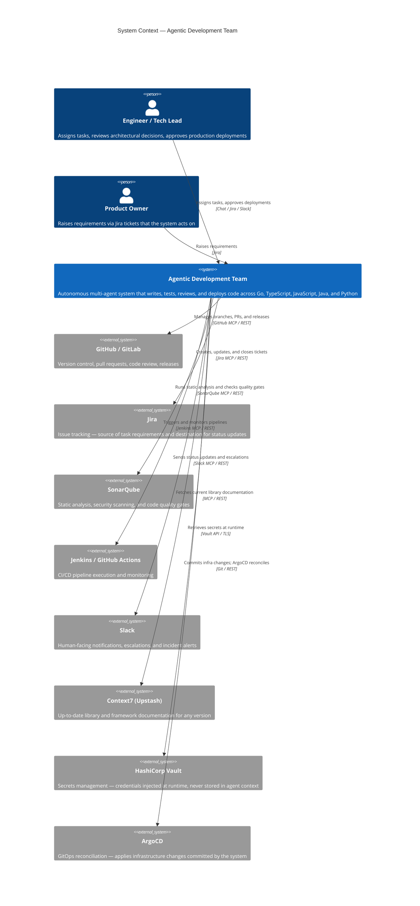

# 01 — System Context

**Audience:** Business stakeholders, architects  
**C4 Level:** 1 — Context

---

## System Purpose

The Agentic Development Team is an autonomous, multi-agent software engineering platform. It accepts development tasks in natural language — from a human engineer, a product ticket, or an automated trigger — and carries out the full development lifecycle: writing tests, implementing code, managing version control, running CI/CD pipelines, reviewing code quality, and deploying to staging. Human engineers remain in control of architectural decisions and production deployments, with all other routine engineering work delegatable to the system.

The system is designed to operate alongside a human engineering team, not replace it. It handles the mechanical throughput of software delivery so that human engineers can focus on product direction, architectural judgment, and work requiring interpersonal context.

---

## Business Context

Software engineering teams face a persistent tension between delivery speed and quality. Code reviews, test writing, dependency hygiene, and CI/CD plumbing are high-value activities that consume significant engineering capacity. The Agentic Development Team externalises this mechanical overhead into an always-available, consistent agent fleet — reducing cycle time from requirement to deployed code while enforcing TDD, security scanning, and code quality gates on every change.

---

## System Context Diagram

---

## External Actors

| Name | Type | Interaction with System |
|---|---|---|
| Engineer / Tech Lead | Person | Assigns tasks in natural language; reviews and approves architectural decisions; approves production deployments via human-in-the-loop checkpoints |
| Product Owner | Person | Raises Jira tickets that the Orchestrator Agent reads as task requirements |
| GitHub / GitLab | External System | VCS host — the system manages branches, commits, pull requests, reviews, and releases via the GitHub/GitLab MCP server |
| Jira | External System | The system reads Jira tickets as task inputs and writes status updates, links, and comments back to tickets |
| SonarQube | External System | The Security and CI/CD Agents invoke SonarQube for SAST, SCA, and quality gate evaluation on every PR |
| Jenkins / GitHub Actions | External System | The CI/CD Agent triggers and monitors pipeline runs; pipeline failures are routed back to the responsible agent |
| Slack | External System | The Orchestrator sends task progress updates, escalations, and incident alerts to engineering Slack channels |
| Context7 (Upstash) | External System | All code-writing and infrastructure agents query Context7 before using any external library to retrieve version-accurate documentation |
| HashiCorp Vault | External System | All credentials (GitHub tokens, Jira API keys, SonarQube tokens, etc.) are stored in Vault and injected into agent containers at runtime; never present in agent context windows |
| ArgoCD | External System | The Infrastructure Agent commits Kubernetes manifest changes to the GitOps repository; ArgoCD detects and reconciles them to the cluster |

---

## System Boundary

Everything inside the "Agentic Development Team" box in the diagram is deployed within the organisation's Red Hat OpenShift AI cluster. This includes all agent containers, inference (vLLM) endpoints, the LangSmith observability instance, the vector store, and all MCP server containers. Nothing inside the boundary has direct internet access; all external system interactions are mediated through authenticated, audited MCP connections.
