# 02 — Container Architecture

**Audience:** Architects, senior engineers  
**C4 Level:** 2 — Container

---

## Overview

The system is composed of four logical layers: an **Agent Layer** (twelve independently deployable Python agents), an **Inference Layer** (four vLLM model-serving endpoints), an **Observability & Skills Layer** (LangSmith and the skills repository), and a **Data Layer** (vector store, object storage). Agents communicate with each other exclusively through the LangGraph state graph, managed by the Orchestrator. Agents communicate with models via the OpenAI-compatible REST API exposed by vLLM. Agents communicate with external tools via the MCP protocol.

The Container diagram below groups agents into capability domains to keep the diagram readable. Individual agent responsibilities are detailed in the service inventory table below.

---

## Container Architecture Diagram

```mermaid
C4Container
  title Container Architecture — Agentic Development Team

  Person(engineer, "Engineer / Tech Lead", "")

  System_Boundary(devteam, "Agentic Development Team — OpenShift AI Cluster") {

    System_Boundary(orchestration, "Orchestration Layer") {
      Container(orchestrator, "Orchestrator Agent", "Python / DeepAgents", "Master supervisor — decomposes tasks, routes to specialist agents, manages human-in-the-loop")
      Container(skills_loader, "Skills Loader", "Python", "Fetches skills from Git repo by tag at agent boot; injects prompts and tools")
    }

    System_Boundary(dev_domain, "Development Domain") {
      Container(code_agent, "Code Agent", "Python / DeepAgents", "Writes production code in Go, TypeScript, JS, Java, Python following TDD")
      Container(test_agent, "Test Agent", "Python / DeepAgents", "Writes and runs tests; enforces TDD Red-Green-Refactor loop")
      Container(review_agent, "Code Review Agent", "Python / DeepAgents", "Reviews PRs for quality, correctness, and test coverage")
    }

    System_Boundary(eng_domain, "Engineering Domain") {
      Container(git_agent, "Git Agent", "Python / DeepAgents", "All VCS operations — branches, commits, PRs, tags, merge conflict resolution")
      Container(cicd_agent, "CI/CD Agent", "Python / DeepAgents", "Writes pipeline definitions, triggers builds, monitors status, manages deployments")
      Container(security_agent, "Security Agent", "Python / DeepAgents", "SAST, SCA, secrets scanning, prompt injection screening; acts as guardrail node")
      Container(infra_agent, "Infrastructure Agent", "Python / DeepAgents", "Manages Kubernetes manifests, Helm charts, and OpenShift resources via GitOps")
    }

    System_Boundary(intel_domain, "Intelligence Domain") {
      Container(arch_agent, "Architecture Agent", "Python / DeepAgents", "Evaluates technical options, writes ADRs, maintains architecture documentation")
      Container(docs_agent, "Documentation Agent", "Python / DeepAgents", "Writes and updates README, API docs, changelogs, and runbooks")
      Container(dep_agent, "Dependency Agent", "Python / DeepAgents", "Monitors dependency versions and CVEs; raises upgrade PRs autonomously")
      Container(incident_agent, "Incident Response Agent", "Python / DeepAgents", "Responds to alerts, diagnoses failures, proposes remediations")
    }

    System_Boundary(inference, "Inference Layer") {
      Container(vllm_reason, "vLLM — Reasoning", "vLLM / Qwen3.5-72B-Instruct", "Serves orchestration, architecture, review, and incident reasoning tasks")
      Container(vllm_code, "vLLM — Code", "vLLM / Qwen2.5-Coder-32B + LoRA", "Serves code generation and test writing; multi-LoRA adapter switching")
      Container(vllm_util, "vLLM — Utility", "vLLM / Qwen2.5-14B-Instruct", "Serves deterministic tool-use agents: git, docs, infra, dependency, CI/CD")
      Container(vllm_guard, "vLLM — Guardrail", "vLLM / Llama-Guard-3-8B", "Safety classifier for all agent inputs and outputs")
    }

    System_Boundary(platform, "Platform Layer") {
      Container(langsmith, "LangSmith", "Self-hosted / Docker", "Full agent observability — traces every LLM call, tool invocation, and sub-agent delegation")
      ContainerDb(vector_db, "Vector Store", "Milvus", "Codebase semantic index for code-similarity lookup before writing new implementations")
      ContainerDb(obj_store, "Object Storage", "ODF / Ceph S3", "Model weights, LoRA adapters, and LangSmith trace archives")
    }

    Container(skills_repo, "Skills Repository", "Git (internal)", "Versioned skill bundles tagged per agent role; loaded at agent boot without redeployment")
  }

  System_Ext(github, "GitHub / GitLab", "")
  System_Ext(jira, "Jira", "")
  System_Ext(sonar, "SonarQube", "")
  System_Ext(jenkins, "Jenkins / GitHub Actions", "")
  System_Ext(slack, "Slack", "")
  System_Ext(context7, "Context7", "")
  System_Ext(vault, "HashiCorp Vault", "")
  System_Ext(argocd, "ArgoCD", "")

  Rel(engineer, orchestrator, "Assigns tasks, approves checkpoints", "HTTPS / Slack")
  Rel(orchestrator, code_agent, "Delegates coding tasks", "LangGraph state / task tool")
  Rel(orchestrator, test_agent, "Delegates test tasks", "LangGraph state / task tool")
  Rel(orchestrator, review_agent, "Delegates PR reviews", "LangGraph state / task tool")
  Rel(orchestrator, git_agent, "Delegates VCS operations", "LangGraph state / task tool")
  Rel(orchestrator, cicd_agent, "Delegates pipeline tasks", "LangGraph state / task tool")
  Rel(orchestrator, security_agent, "Delegates security scans", "LangGraph state / task tool")
  Rel(orchestrator, arch_agent, "Delegates architecture decisions", "LangGraph state / task tool")
  Rel(orchestrator, docs_agent, "Delegates documentation tasks", "LangGraph state / task tool")
  Rel(orchestrator, infra_agent, "Delegates infra changes", "LangGraph state / task tool")
  Rel(orchestrator, dep_agent, "Triggers dependency scans", "LangGraph state / task tool")
  Rel(orchestrator, incident_agent, "Triggers incident response", "LangGraph state / task tool")

  Rel(orchestrator, vllm_reason, "LLM inference", "REST / OpenAI-compatible")
  Rel(code_agent, vllm_code, "LLM inference", "REST / OpenAI-compatible")
  Rel(test_agent, vllm_code, "LLM inference", "REST / OpenAI-compatible")
  Rel(review_agent, vllm_reason, "LLM inference", "REST / OpenAI-compatible")
  Rel(arch_agent, vllm_reason, "LLM inference", "REST / OpenAI-compatible")
  Rel(incident_agent, vllm_reason, "LLM inference", "REST / OpenAI-compatible")
  Rel(git_agent, vllm_util, "LLM inference", "REST / OpenAI-compatible")
  Rel(cicd_agent, vllm_util, "LLM inference", "REST / OpenAI-compatible")
  Rel(docs_agent, vllm_util, "LLM inference", "REST / OpenAI-compatible")
  Rel(infra_agent, vllm_util, "LLM inference", "REST / OpenAI-compatible")
  Rel(dep_agent, vllm_util, "LLM inference", "REST / OpenAI-compatible")
  Rel(security_agent, vllm_guard, "Safety classification", "REST / OpenAI-compatible")

  Rel(skills_loader, skills_repo, "Fetches skills by Git tag", "Git / HTTPS")

  Rel(git_agent, github, "Branch, commit, PR, release", "GitHub MCP")
  Rel(review_agent, github, "Comment, approve, request changes", "GitHub MCP")
  Rel(cicd_agent, jenkins, "Trigger and monitor pipelines", "Jenkins MCP")
  Rel(security_agent, sonar, "SAST, SCA, quality gate", "SonarQube MCP")
  Rel(orchestrator, jira, "Read tickets, update status", "Jira MCP")
  Rel(orchestrator, slack, "Status updates and alerts", "Slack MCP")
  Rel(code_agent, context7, "Fetch library documentation", "Context7 MCP")
  Rel(infra_agent, argocd, "Commits manifests; ArgoCD reconciles", "Git")
  Rel(code_agent, vector_db, "Semantic codebase search", "gRPC / Milvus SDK")

  UpdateLayoutConfig($c4ShapeInRow="3", $c4BoundaryInRow="1")
```

---

## Agent Service Inventory

| Agent | Model Tier | Responsibility | Communication In | Communication Out |
|---|---|---|---|---|
| Orchestrator | Reasoning | Master supervisor; task decomposition; human-in-the-loop | Engineer, Jira webhooks, Slack | All other agents via `task` tool |
| Code Agent | Code (+ LoRA) | Writes production code; TDD implementation | Orchestrator | Test Agent (TDD loop), Git Agent, Context7, vector store |
| Test Agent | Code (+ LoRA) | Writes tests; runs suite; enforces coverage thresholds | Orchestrator, Code Agent | Code Agent (test results), CI/CD Agent |
| Code Review Agent | Reasoning | Reviews PRs; checks quality and coverage | Orchestrator | GitHub (comments/approval), SonarQube |
| Git Agent | Utility | All VCS operations — branches, commits, PRs, tags | Orchestrator | GitHub / GitLab MCP |
| Architecture Agent | Reasoning | Evaluates options; writes ADRs; maintains architecture docs | Orchestrator | Filesystem, GitHub, Context7 |
| CI/CD Agent | Utility | Pipeline definitions, build triggers, deployment management | Orchestrator | Jenkins MCP, Kubernetes MCP, GitHub MCP |
| Security Agent | Guardrail + Utility | SAST/SCA; guardrail input/output screening; secrets detection | All agents (as guardrail), Orchestrator | SonarQube MCP, GitHub (PR block) |
| Documentation Agent | Utility | README, API docs, changelogs, runbooks | Orchestrator | Filesystem, GitHub |
| Infrastructure Agent | Utility | Kubernetes manifests, Helm, OpenShift resources | Orchestrator | Kubernetes MCP, GitOps repo |
| Dependency Agent | Utility | Dependency version monitoring; upgrade PRs; CVE scanning | Orchestrator (scheduled) | GitHub MCP, SonarQube MCP |
| Incident Response Agent | Reasoning | Alert triage, log analysis, root cause, remediation | Alert triggers, Orchestrator | Kubernetes MCP, GitHub, Jira |

---

## Communication Patterns

The system uses two internal and two external communication patterns:

**LangGraph state (internal, agent-to-agent):** All inter-agent communication flows through LangGraph's typed state graph. The Orchestrator delegates to specialist agents using DeepAgents' `task` tool, which spawns a sub-agent with an isolated context window and a structured result contract. Results flow back as typed state updates. There is no direct agent-to-agent communication; all routing is mediated by the graph.

**OpenAI-compatible REST (internal, agent-to-model):** All agents call their assigned vLLM inference endpoint using LangChain's `init_chat_model` with the `openai:` prefix and a `base_url` pointing to the appropriate vLLM KServe endpoint. Agents do not hold model references; the endpoint URL is injected via environment variable at pod start.

**MCP protocol (agent-to-external-tools):** All interactions with external systems (GitHub, Jira, SonarQube, Jenkins, Kubernetes, Slack, Context7) flow through MCP servers running as UBI-based containers within the cluster. MCP is handled by `langchain-mcp-adapters`, which presents MCP tools as standard LangChain tools to the agent. Agents never call external APIs directly.

**GitOps (Infrastructure Agent → ArgoCD):** The Infrastructure Agent never applies manifests directly to the cluster. It commits manifest changes to the GitOps repository; ArgoCD detects the diff and reconciles. This provides a full audit trail for all infrastructure changes.
