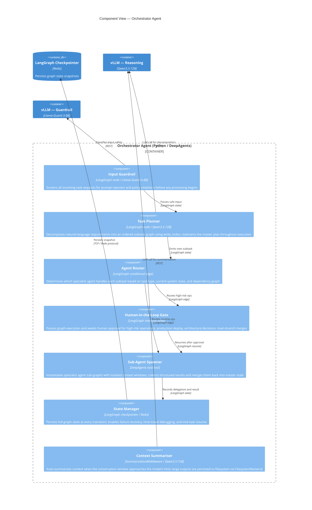
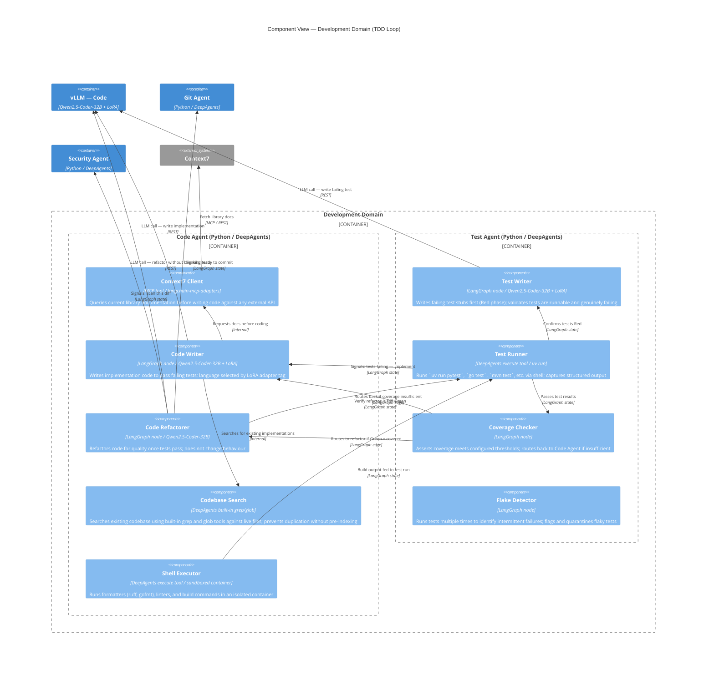

# 03 — Component View

**Audience:** Engineers  
**C4 Level:** 3 — Component

This document provides component-level views of the two most architecturally significant containers: the **Orchestrator Agent** (the central hub of all system activity) and the **Development Domain** (the TDD loop between Code Agent and Test Agent). These are where the most complex internal coordination occurs.

---

## Orchestrator Agent — Component View

The Orchestrator Agent is a compiled LangGraph graph. Its internal components are the nodes and edges of that graph, plus supporting services injected at boot.

### Internal Dependency Rules

- The Input Guardrail node is always the first node in every graph execution path. No LLM call or tool invocation may precede it.
- The Human-in-the-Loop Gate may only be bypassed by conditional edges that have been explicitly whitelisted in the router configuration.
- The Task Planner must not call any external tool directly. All external actions must flow through a specialist sub-agent.
- State snapshots are taken before and after every node execution. A node failure leaves the previous snapshot intact; the graph resumes from that snapshot on retry.
- The Context Summariser uses `SummarizationMiddleware` from DeepAgents (≥0.6.1) backed by `FilesystemBackend`. It does not rely on a separate summarisation pipeline.

---

## Development Domain — TDD Loop Component View

The TDD loop is the core value-delivery mechanism of the system. It is a structured cycle between the Code Agent and Test Agent, mediated by the Orchestrator.

### TDD Phase Transitions

The state machine enforces the Red → Green → Refactor sequence structurally — it is not a guideline:

1. **Red:** Test Writer produces tests; Test Runner confirms they fail. If tests pass immediately, the Test Writer is routed back to write more specific tests.
2. **Green:** Code Writer implements; Test Runner confirms all tests pass. If any test fails, Code Writer is re-invoked with the failure context.
3. **Refactor:** Code Refactorer improves code quality; Test Runner confirms no regression. If a regression is introduced, Code Refactorer is re-invoked with the diff and failure.
4. **Gate:** Security Agent scans the diff; Code Review Agent reviews; Git Agent commits and creates a PR.

A task does not exit the Development Domain until it is Green, Refactored, scanned, reviewed, and committed.

<!-- enriched by architecture-docs skill, 2026-05-15 -->
