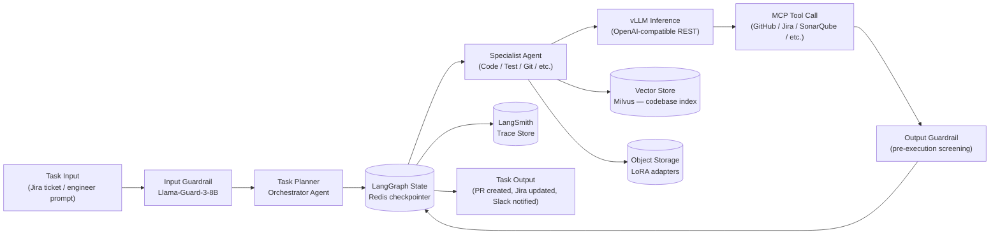

# 04 — Data Architecture

**Audience:** Engineers, architects

---

## Data Store Inventory

| Store | Type | Technology | Data Owned | Shared? |
|---|---|---|---|---|
| LangGraph Checkpointer | Key-value / in-memory | Redis | LangGraph execution state snapshots — serialised graph state persisted per node transition | No — exclusively owned by the agent runtime |
| Vector Store | Vector database | Milvus | Codebase semantic embeddings — chunks of source code indexed for similarity search | Read-shared across Code, Architecture, and Documentation Agents |
| Object Storage | Object storage | ODF / Ceph (S3-compatible) | Model weights (Qwen3.5-72B, Qwen2.5-Coder-32B, Qwen2.5-14B, Llama-Guard-3-8B), LoRA adapter files, LangSmith trace archives | Read-shared across all vLLM endpoints; write-exclusive to ML Ops processes |
| LangSmith Trace Store | Columnar / document | LangSmith internal (self-hosted) | Full execution traces: LLM call inputs/outputs, tool invocations, latency, token counts | Read-shared via LangSmith UI and API; no agent writes directly |
| Skills Repository | Git object store | Internal Git (Gitea or GitLab) | Skill bundles (prompt extensions + tool configs) tagged per agent role | Read-shared across all agents via Skills Loader; write-exclusive to engineers |

---

## Data Ownership Notes

Each data store has a single owning process. Agents that read shared stores do so through defined interfaces (Milvus SDK, LangSmith SDK, Git clone/fetch) and may not write to stores they do not own. The principle of least privilege applies: agent service accounts are granted read-only access to shared stores.

The Vector Store is read-shared across three agents; however, writes to it (embedding new code) are performed exclusively by a scheduled indexing job, not by agents at runtime. This prevents concurrent write contention and ensures embedding consistency.

---

## LangGraph State Schema

The primary "database" of the system at runtime is the LangGraph state object. It flows through the Orchestrator graph and is persisted at every node transition by the Redis checkpointer (`langgraph-checkpoint-redis`). Its stable structure (not the volatile implementation fields) is:

| Field | Type | Description |
|---|---|---|
| `task_id` | UUID | Unique identifier for the current task, linked to the originating Jira ticket |
| `task_description` | string | Natural-language description of the work to be done |
| `plan` | list[TodoItem] | The current task plan produced by the Task Planner; updated as tasks complete |
| `current_subtask` | TodoItem | The subtask currently being executed |
| `agent_results` | map[agent_id → AgentResult] | Structured results returned by each specialist agent |
| `human_approvals` | map[checkpoint_id → ApprovalStatus] | Record of human-in-the-loop decisions |
| `run_id` | UUID | LangSmith run ID — propagated to all sub-agent traces for cross-trace correlation |
| `branch_name` | string | The Git feature branch name created for this task |
| `pr_url` | string or null | The pull request URL once the PR has been created |
| `status` | enum | `planning` → `in_progress` → `awaiting_approval` → `completed` → `failed` |

The state schema is the formal contract between the Orchestrator and all specialist agents. Changes to field names or types require a version bump and a coordinated release.

---

## Data Flow Diagram

---

## Event Catalog

The system does not use a traditional message broker. Agent coordination events are encoded as LangGraph state transitions persisted to the Redis checkpointer. The following table documents the significant state transitions that function as system events:

| Transition / Event | Producer | Consumer(s) | Schema (key fields) |
|---|---|---|---|
| `task.planned` | Orchestrator Task Planner | Agent Router | `task_id`, `plan[]`, `branch_name` |
| `subtask.delegated` | Agent Router | Specialist Agent | `subtask_id`, `agent_type`, `context` |
| `tests.red` | Test Agent | Code Agent | `subtask_id`, `test_file_paths[]`, `failure_output` |
| `tests.green` | Test Agent | Code Refactorer | `subtask_id`, `coverage_pct`, `test_run_output` |
| `diff.ready_for_scan` | Code Agent | Security Agent | `subtask_id`, `diff_summary`, `file_paths[]` |
| `scan.complete` | Security Agent | Code Review Agent | `subtask_id`, `findings[]`, `severity_max` |
| `pr.approved` | Code Review Agent | Git Agent | `subtask_id`, `pr_url`, `approval_status` |
| `deployment.staging_complete` | CI/CD Agent | Orchestrator | `task_id`, `deployment_url`, `pipeline_run_id` |
| `approval.required` | HITL Gate | Human | `task_id`, `operation`, `risk_level`, `context_summary` |
| `approval.granted` | Human | Orchestrator | `checkpoint_id`, `approved_by`, `timestamp` |

All transitions carry the LangSmith `run_id` as a correlation field, linking the state event to the full execution trace.

---

## Schema and Migration Management

The LangGraph Checkpointer data structure in Redis is managed by the `langgraph-checkpoint-redis` library and should not be modified directly. Redis key TTL and eviction policy must be configured to `noeviction` (or `allkeys-lru` with sufficient memory) to prevent in-flight graph state being silently dropped. The Milvus collection schema (embedding dimensions, metadata fields) is defined in `infra/milvus/schema.py`; schema changes require a collection migration. The Infrastructure Agent applies collection changes as part of the deployment workflow.
