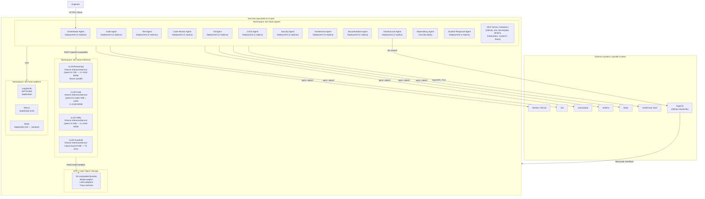

# 05 — Deployment

**Audience:** DevOps, platform engineers  
**Deployment target:** Red Hat OpenShift AI (Kubernetes 4.x)

---

## Deployment Architecture Diagram



---

## Environments

| Environment | Purpose | Deployment Trigger | Human Approval |
|---|---|---|---|
| Development | Agent development and skill testing | Manual / feature branch push | Not required |
| Staging | Full integration testing before production; agents run against staging external tools | Merge to `main` branch | Not required |
| Production | Live system serving engineering tasks | Tagged release (semantic version) | **Required** — CI/CD Agent pauses at HITL gate |

---

## Scaling Strategy

**Agent containers:** Agent Deployments are configured with **KEDA** (Kubernetes Event-Driven Autoscaling) targeting the LangSmith task queue depth metric. When pending task count exceeds threshold, KEDA scales up agent replicas. Minimum replicas ensure cold-start latency is avoided for the Orchestrator and Security Agent.

**vLLM inference endpoints:**
- The Reasoning endpoint (Qwen3.5-72B) runs on fixed 2× A100 GPU allocation — tensor parallel across both GPUs. Not horizontally scaled; the model fills the allocation.
- The Code endpoint (Qwen2.5-Coder-32B) scales horizontally: KEDA triggers a new replica when request queue depth exceeds N. Each replica requires one A100 80GB.
- The Utility endpoint (Qwen2.5-14B) scales horizontally on A100 40GB GPUs.
- The Guardrail endpoint (Llama-Guard-3-8B) scales horizontally on T4 GPUs; latency SLA is <500ms.

**Redis (checkpointer):** Deployed as a StatefulSet with Redis Sentinel for high availability (1 primary, 2 replicas). Eviction policy set to `noeviction` to protect in-flight graph state. AOF persistence enabled for durability. **Milvus (vector store):** Deployed as a StatefulSet in standalone mode for initial launch; cluster mode available for horizontal scaling when embedding volume grows. etcd and MinIO (or ODF) used as Milvus's internal metadata and object storage backends.

---

## CI/CD Pipeline

The system's own CI/CD pipeline is managed by GitHub Actions (or Jenkins for on-premises). The CI/CD Agent is responsible for writing and maintaining the pipeline definitions.

```
Push to feature branch
  └── Lint (uv run ruff check, uv run mypy)
  └── Unit tests (uv run pytest, go test, mvn test)
  └── SonarQube scan (quality gate must pass)
  └── Container image build (podman build, UBI base)
  └── Image push to internal registry

Merge to main
  └── All above checks
  └── Integration tests (agents run against mock MCP servers)
  └── Container images promoted to staging tag
  └── ArgoCD syncs staging namespace
  └── E2E smoke test against staging environment

Tagged release (e.g. v1.2.0)
  └── All above checks
  └── Container images promoted to production tag
  └── CI/CD Agent raises HITL approval request
  └── [Human approves]
  └── ArgoCD syncs production namespace
  └── LangSmith deployment event recorded
```

---

## GitOps Model

All Kubernetes resource definitions (Deployments, Services, ConfigMaps, KServe InferenceService manifests, KEDA ScaledObjects) are stored in a dedicated GitOps repository (`git.internal/dev-team/infra-gitops`). The Infrastructure Agent commits changes to this repository; ArgoCD reconciles them to the cluster. No agent applies `kubectl apply` directly — the GitOps repository is the single source of truth for cluster state.

---

## Event Replay

LangGraph's built-in checkpointing enables task replay. Because state is persisted at every node transition, any interrupted task can be resumed from its last successful checkpoint without re-executing completed steps. This is not a message-bus event replay mechanism — it is graph-state resume. Operational playbook for task resume: see runbooks (maintained by Documentation Agent).
